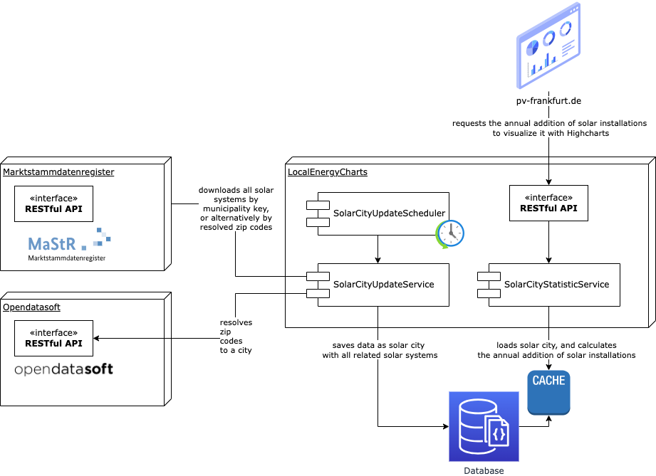

# Local Energy Charts #

More than 70% of global greenhouse gas emissions are generated in cities. The local concentration of people and industry makes cities hotspots of energy consumption. The solar potential in cities is huge, but often only a fraction is used. Therefore, cities play an important role in stopping the climate crisis. 

Since local reports on greenhouse gas emissions are often unavailable, or delayed, this application is intended to make the daily state of local renewable energies visible.

The data basis is provided by the [Marktstammdatenregister](https://www.marktstammdatenregister.de/MaStR), where all electricity generation plants are registered.

You can find the feature documentation at the following links:

* [highcharts: annual addition of solar installations](testing/src/test/resources/cucumber/annual_addition_of_solar_installations.feature) 
* [introduction: solar overview](testing/src/test/resources/cucumber/solar_systems_overview.feature) 
* [action: now we need roofs!](testing/src/test/resources/cucumber/now_we_need_roofs.feature) 
* [solar building pie chart](testing/src/test/resources/cucumber/solar_building_pie_chart.feature) 

Please visit:

https://pv-frankfurt.de/

## Open API ##

This application comes with an [OpenAPI](https://pv-frankfurt.de/openapi.html) that allows you to easily create a new solar overview for cities.
You just need the [municipality key](https://www.statistikportal.de/de/gemeindeverzeichnis) of your city, and optionally the [rooftop solar potential](https://eosolar.dlr.de/) and the target year. 
Then all solar installations are downloaded from the [Marktstammdatenregister](https://www.marktstammdatenregister.de/MaStR), and updated daily.
Alternatively, the municipality key can be left empty and the zip code search can be used instead. Then please make sure that your city is listed in [Opendatasoft](https://public.opendatasoft.com/explore/dataset/georef-germany-postleitzahl/information/).

The API then provides you with a statistical analysis for the annual addition of solar installations, 
including the distribution of balcony power plants, apartment buildings, homes, schools or industrial buildings.

### Usage ###

First, create a new *solar city*

    POST /v1/create/solar-city

with basic auth user/secret and request body:

```json
{
  "cityName": "Frankfurt am Main",
  "municipalityKey": "06412000",
  "entireSolarPotentialOnRooftopsMWp": 2100.0,
  "targetYear": 2035
}
```

Then request e.g.:

    GET /v1/solar-cities/<id>/statistics/annual-addition-of-solar-installations/highcharts

### Postman ###

You can also test the API with Postman. Find the full collection in [here](api/LocalEnergyCharts.postman_collection.json).

## Architecture ##
.

## Getting Started Yourself ##
Configure your path to the web folder in application.yaml.

    spring.web.resources.static-locations=file:/<path>/local-energy-charts/web/

If you want to host the application yourself, please install Java version 21, Docker with Docker Compose and run the following commands.

    docker compose up -d
    ./gradlew bootRun

Then execute the requests above on http://localhost:8080

See also the [postman collection](api/LocalEnergyCharts.postman_collection.json).

Finally, visit http://localhost:8080

## Testing ##

To test the application, and at the same time document it, [Cucumber](https://cucumber.io/) was used. Documentation and tests can be found in the following module.

    test/src/test/resources/cucumber

Please start the application in test mode as follows, and run the tests.

    docker compose up -d
    ./gradlew clean bootRun --args='--spring.profiles.active=test' 
    ./gradlew cucumberCli

## Webflow, Highcharts & build the Website ##

The website is developed, designed and previewed with [Webflow](https://webflow.com/). 
Html, CSS and JavaScript are then downloaded and saved in the web folder.

The charts are realised with [Highcharts](https://www.highcharts.com/). 
For this, there are additional JavaScripts to request the API of this application in order to provide data for the Highcharts. 
See in the folder web/js/ e.g. [localenergycharts.js](web/js/localenergycharts.js).

Root for the website is the folder web/build, which is configured in the application.properties in main and is built with Gradle. 
All JavaScripts and CSS files are minified. During the build, localenergycharts.js can be configured by setting the parameter baseApiUrl.

    ./gradlew clean build -PbaseApiUrl="https://pv-frankfurt.de

Start the application and enjoy the website :)!
